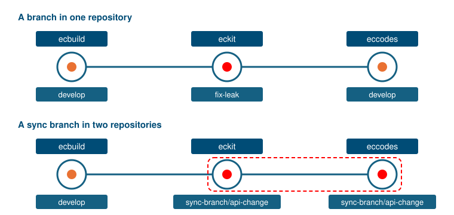

.. SPDX-FileCopyrightText: 2026 European Centre for Medium-Range Weather Forecasts (ECMWF)
..
.. SPDX-License-Identifier: Apache-2.0

Coordinated changes across repositories
=======================================

Some changes span several repositories, e.g. a changed eckit interface that eccodes starts to use.
Tested one by one, both sides fail:
eckit's downstream CI builds eccodes' ``develop``, which does not use the changed interface yet,
and eccodes' own CI builds against eckit's ``develop``, which does not have it yet.

Such changes go on branches with the same name in every repository involved,
starting with ``sync-branch/`` or ``feature/``:

         Bottom: eckit and eccodes are both on sync-branch/api-change and are built together; ecbuild is on develop.
   :width: 100%

On such a branch, :action:`resolve-deps` resolves every upstream that has a branch of the same name at that branch,
and all others at their ``ref`` from :doc:`manifest`.
In a :doc:`downstream <downstream>` run, :action:`pick-ref` likewise checks out each consumer's branch of that name,
where it exists.
In the example, eccodes' ``sync-branch/api-change`` is therefore always built against eckit's,
while ecbuild stays on ``develop``.
Any other branch, such as ``fix-leak``, or such a branch that exists in one repository only,
keeps testing against ``ref`` from :doc:`manifest`.

If pull requests are merged from upstream to downstream, eckit before eccodes in this example, everything stays green.
