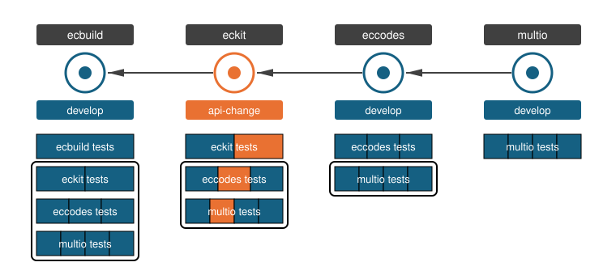
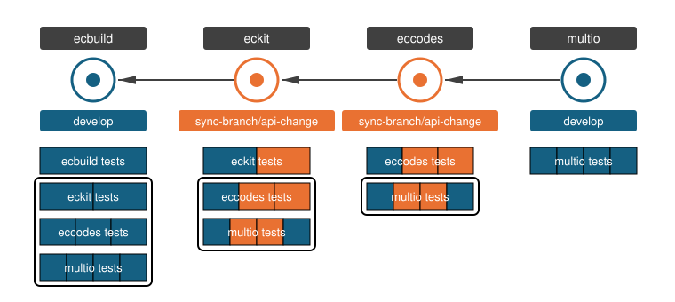
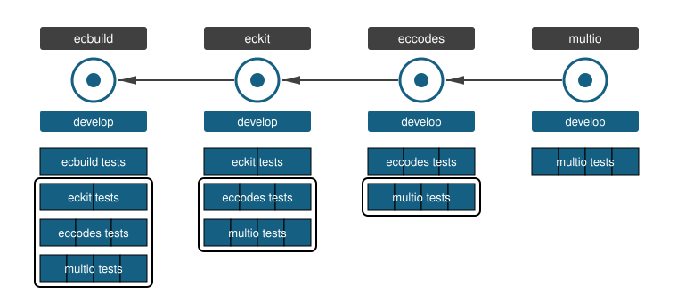
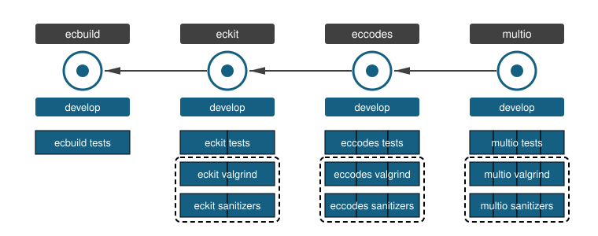

.. SPDX-FileCopyrightText: 2026 European Centre for Medium-Range Weather Forecasts (ECMWF)
..
.. SPDX-License-Identifier: Apache-2.0

Running the downstream CI
=========================

This page is open for debate and most likely to change in the near future (as of 2026-09-30)

Running the downstream CI asks a very specific question:
Do my changes break downstream code?

Up until now, we unconditionally executed the downstream CI which puts a large strain on resources
and sometimes is not necessary.
In particular it meant that the CI **always** ran for several hours, which incentiviced
to not use PRs but to push directly to the default branch.
This then broke downstream packages with errors that would have already been caught with normal tests and no downstream CI.
So the downstream CI partially caused the exact problems it was designed to prevent.

Hence, one big design constraint of the new system is to ensure that a minimal test is always ran,
but to limit the cost of the downstream CI if it does not add much value.

This is a valid question and sometimes

We

         Each test box is coloured left to right by the branch of every repository it is built from:
         eckit's CI runs eckit's, eccodes' and multio's tests with an orange eckit part,
         which differ from the all-blue tests that eccodes' and multio's own CI run.
   :width: 100%

   Chain ecbuild, eckit, eccodes, multio; eckit is on branch api-change, the others on develop.
   Each test box is coloured left to right by the branch of every repository it is built from:
   eckit's CI runs eckit's, eccodes' and multio's tests with an orange eckit part,
   which differ from the all-blue tests that eccodes' and multio's own CI run.

         eckit's downstream CI runs eccodes' and multio's tests with the same colouring as eccodes' own CI: the same tests.
   :width: 100%

   Chain ecbuild, eckit, eccodes, multio; eckit and eccodes are both on sync-branch/api-change, ecbuild and multio on develop.
   eckit's downstream CI runs eccodes' and multio's tests with the same colouring as eccodes' own CI: the same tests.

   Chain ecbuild, eckit, eccodes, multio, all on develop, each depending on the one to its left; under each repository the tests a change to it runs, its own and those of every repository downstream, all blue: the same tests repeated.

         every repository runs its own tests, and all but ecbuild also expensive nightly tests, valgrind and sanitizers: a constant number more per repository instead of n squared.
   :width: 100%

   Chain ecbuild, eckit, eccodes, multio, all on develop; instead of the redundant downstream tests,
   every repository runs its own tests, and all but ecbuild also expensive nightly tests, valgrind and sanitizers: a constant number more per repository instead of n squared.
